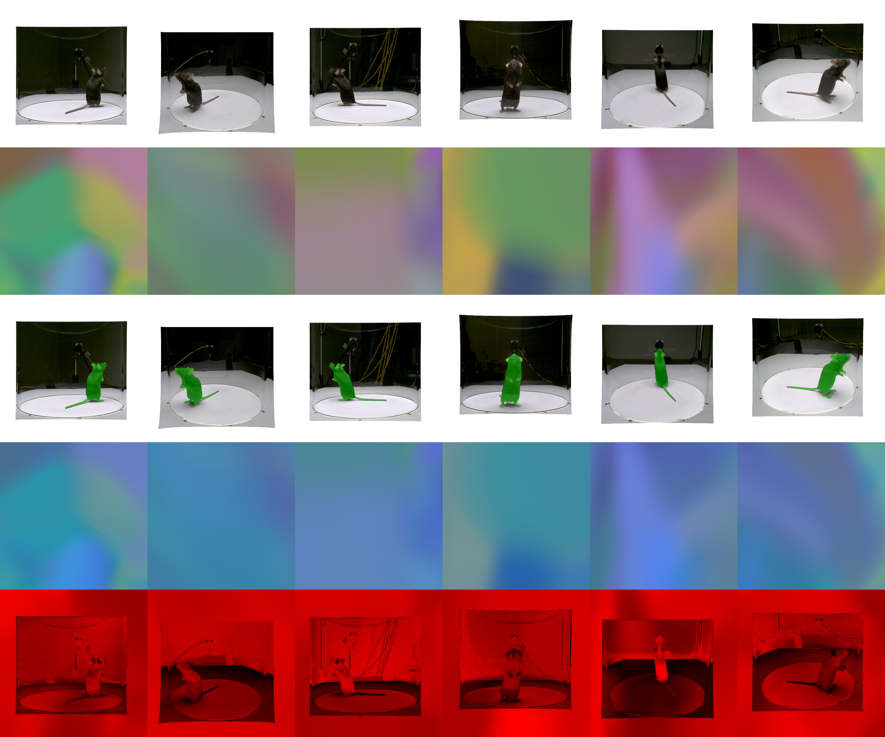

# Alpha Analysis Report (WandB Style)

**Generated**: 2026-01-22 18:27:52
**Checkpoint**: `checkpoints/_temp/D7_1_E1_1_paper_random/ckpt_0000000000002300.pt`
**Step**: unknown
**Sample**: `/home/joon/data/preprocessed/FaceLift_mouse/D7_1/train/000000`

## Visualization Layout

- Row 1: GT RGB
- Row 2: Rendered RGB
- Row 3: GT + GT Mask overlay (green)
- Row 4: Rendered + Alpha Mask overlay (blue, threshold=0.5)
- Row 5: Error heatmap

## Rendered Alpha Statistics

| Metric | Value |
|--------|-------|
| Min | 0.7305 |
| Max | 0.9999 |
| Mean | 0.9999 |
| % > 0.5 | 100.0% |

## GT Mask Statistics

| Metric | Value |
|--------|-------|
| Min | 0.0000 |
| Max | 1.0000 |
| Mean | 0.0276 |
| % > 0.5 | 2.8% |

## Observation

Rendered alpha is saturated (mean > 0.9) - opacity regularization needed
