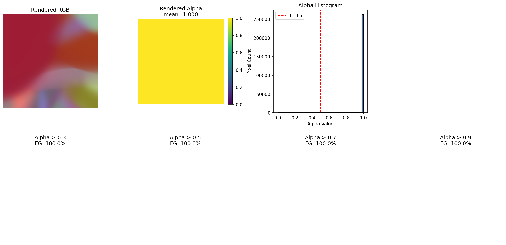

# Rendered Alpha Analysis Report

**Generated**: 2026-01-22 18:18:08
**Checkpoint**: `checkpoints/_temp/D7_1_E4_7_optimal_alpha/ckpt_0000000000001600.pt`
**Config**: `checkpoints/_temp/D7_1_E4_7_optimal_alpha/config.yaml`
**Sample**: `/home/joon/data/preprocessed/FaceLift_mouse/D7_1/train/000000`

---

## 1. Alpha Statistics

| Metric | Value |
|--------|-------|
| Min | 0.9998 |
| Max | 0.9999 |
| Mean | 0.9999 |
| Std | 0.0000 |
| Median | 0.9999 |
| % > 0.5 | 100.0% |
| % > 0.7 | 100.0% |
| % > 0.9 | 100.0% |

---

## 2. Single View Analysis

---

## 3. All Views Grid

**Rows**:
1. Rendered RGB
2. Rendered Alpha (grayscale)
3. Alpha > 0.5 (binary mask)

---

## 4. Observations

### Alpha Distribution
- Mean alpha: 1.000
- ⚠️ Alpha seems to spread beyond object (mean > 0.3)
- ⚠️ Many high-alpha pixels (>50% above 0.5)

### Recommendations

- Consider higher `alpha_mask_threshold` (0.7+)
- Add `opacity_reg_weight: 0.02` with `opacity_reg_type: "l1_sparse"`
- Or use `mask_mode: "gt"` if GT masks are available

---

*Generated by analyze_rendered_alpha.py | FaceLift Mouse Project*
