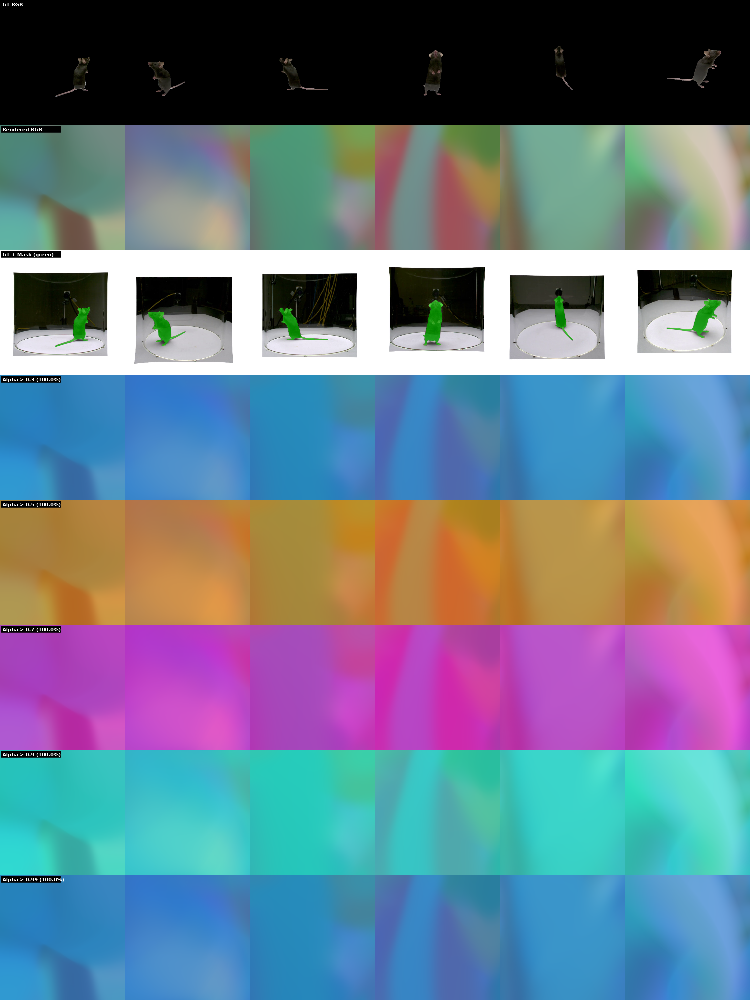

# Alpha Threshold Comparison

**Checkpoint**: `checkpoints/_temp/D7_1_E1_1_paper_random/ckpt_0000000000002300.pt`
**Step**: unknown
**Thresholds**: [0.3, 0.5, 0.7, 0.9, 0.99]

## Alpha Statistics

| Metric | Value |
|--------|-------|
| Min | 0.9999 |
| Max | 0.9999 |
| Mean | 0.9999 |
| % > 0.3 | 100.0% |
| % > 0.5 | 100.0% |
| % > 0.7 | 100.0% |
| % > 0.9 | 100.0% |
| % > 0.99 | 100.0% |

## GT Mask Statistics

| Metric | Value |
|--------|-------|
| Mean | 0.0276 |
| % > 0.5 | 2.8% |

## Visualization

**Rows:**
- Row 0: GT RGB
- Row 1: Rendered RGB
- Row 2: GT + Mask (green)
- Row 3: Alpha > 0.3 (100.0%)
- Row 4: Alpha > 0.5 (100.0%)
- Row 5: Alpha > 0.7 (100.0%)
- Row 6: Alpha > 0.9 (100.0%)
- Row 7: Alpha > 0.99 (100.0%)
