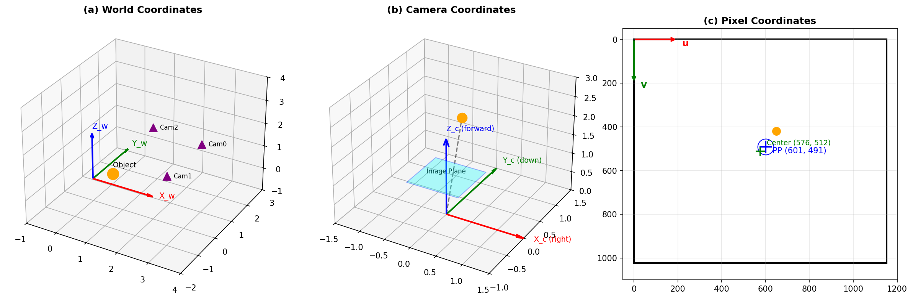
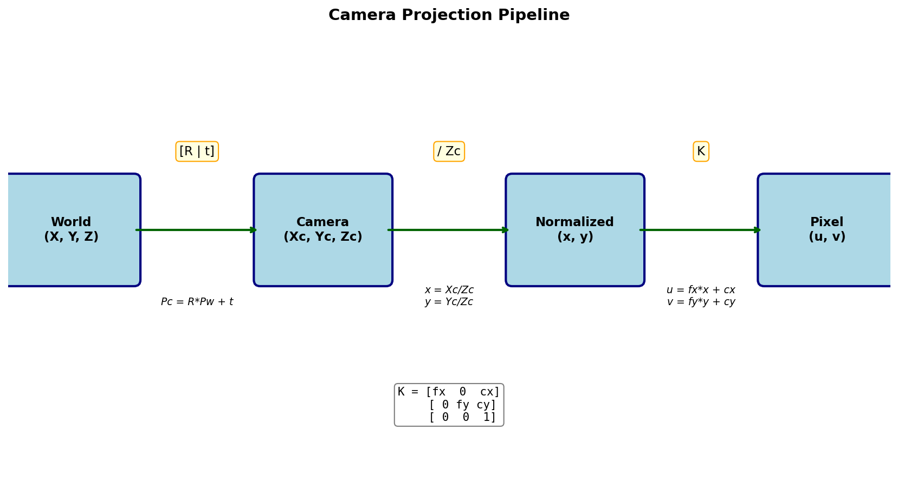
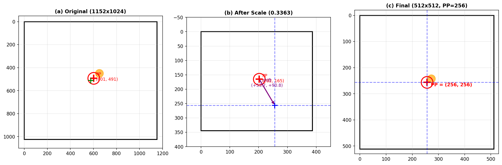
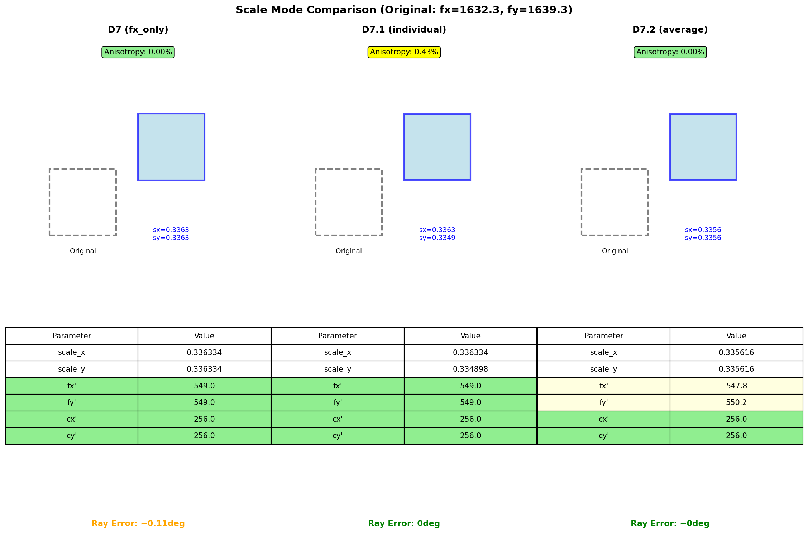
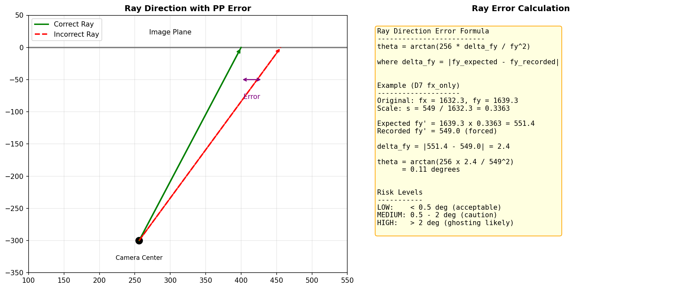

# D7 Scale Modes 이론 및 공식

> Created: 2026-01-20
> Report: mouse_extensions/reports/07_coordinate_analysis/

---

## 1. 좌표계 개요



### 1.1 World Coordinates (X_w, Y_w, Z_w)
3D 공간의 절대 좌표계. 모든 카메라와 객체 위치의 기준.

### 1.2 Camera Coordinates (X_c, Y_c, Z_c)
- **X_c**: 오른쪽 방향
- **Y_c**: 아래쪽 방향
- **Z_c**: 카메라 시선 방향 (광축)

### 1.3 Pixel Coordinates (u, v)
- **Principal Point (cx, cy)**: 광축이 이미지와 만나는 점
- **원본**: cx=601.3, cy=491.2 (이미지 중앙 아님)
- **목표**: cx=cy=256 (이미지 중앙)

---

## 2. Projection Pipeline



### 2.1 World → Camera
```
P_camera = R * P_world + t
```

### 2.2 Camera → Normalized
```
x = X_c / Z_c
y = Y_c / Z_c
```

### 2.3 Normalized → Pixel
```
u = fx * x + cx
v = fy * y + cy
```

### 2.4 Intrinsic Matrix
```
K = [fx  0  cx]
    [ 0 fy cy]
    [ 0  0  1]
```

---

## 3. PP-Centered Shift



D7 전처리의 핵심: **Principal Point를 이미지 중앙(256, 256)으로 이동**

### 3.1 Scale 계산
```
scale_x = target_fx / orig_fx = 549 / 1632.3 = 0.3363
scale_y = target_fy / orig_fy = 549 / 1639.3 = 0.3349
```

### 3.2 Shift 계산
```
shift_x = 256 - (orig_cx × scale_x) = 256 - (601.3 × 0.3363) = +53.7
shift_y = 256 - (orig_cy × scale_y) = 256 - (491.2 × 0.3349) = +91.5
```

### 3.3 Affine Transform
```
[u']   [scale_x    0   ] [u]   [shift_x]
[v'] = [   0    scale_y] [v] + [shift_y]
```

---

## 4. Scale Mode 비교



| Mode | scale_x | scale_y | fx' | fy' | Ray Error |
|------|---------|---------|-----|-----|-----------|
| **D7 (fx_only)** | 0.3363 | 0.3363 | 549.0 | 549.0 (forced) | ~0.4° |
| **D7.1 (individual)** ★ | 0.3363 | 0.3349 | 549.0 | 549.0 | **0°** |
| **D7.2 (average)** | 0.3356 | 0.3356 | ~547 | ~551 | ~0° |

### D7 (fx_only)
- 동일 scale 사용, fy 강제 기록
- 장점: 간단, fx=fy=549 보장
- 단점: fy 불일치로 ray error 발생

### D7.1 (individual) ★ 권장
- 개별 scale_x, scale_y 사용
- 장점: 기하학적으로 완벽, ray error = 0
- 단점: ~0.6% anisotropic scaling (무시 가능)

### D7.2 (average)
- 평균 scale 사용
- 장점: Isotropic scaling (종횡비 보존)
- 단점: fx, fy가 정확히 549 아님

---

## 5. Ray Direction Error



### 5.1 공식
```
theta_error = arctan(256 × delta_fy / fy²)
```

### 5.2 예시 (D7 fx_only)
```
Expected fy' = 1639.3 × 0.3363 = 551.5
Recorded fy' = 549.0 (forced)
delta_fy = |551.5 - 549.0| = 2.5

theta = arctan(256 × 2.5 / 549²)
      = 0.12°
```

### 5.3 Risk Levels
- **LOW**: < 0.5° (acceptable)
- **MEDIUM**: 0.5° - 2° (caution)
- **HIGH**: > 2° (ghosting likely)

---

## 6. 명령어

```bash
# D7.1 (권장)
python -m mouse_extensions.preprocessing.preprocess --preset D7.1 --input-dir /path/to/raw --output-dir /path/to/D7_1

# D7.2
python -m mouse_extensions.preprocessing.preprocess --preset D7.2 --input-dir /path/to/raw --output-dir /path/to/D7_2
```

---

## 7. 보고서 재생성

```bash
# 좌표계 분석 보고서 생성
python -m mouse_extensions.scripts.report_generator.coordinate_report_generator --camera-pkl /path/to/cam.pkl --output reports/coordinate_analysis

# 전처리 비교 보고서 생성
python -m mouse_extensions.scripts.report_generator.generate_report --datasets D7,D7_1,D7_2 --output reports/comparison --with-figures
```

---

*FaceLift Mouse Extension | 2026-01-20*
