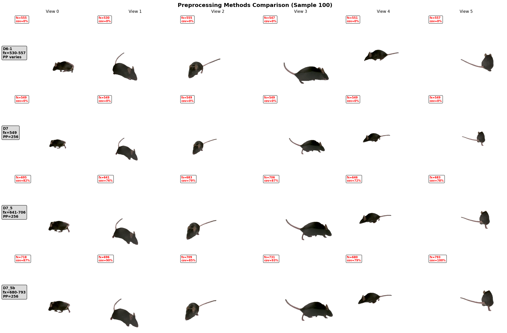
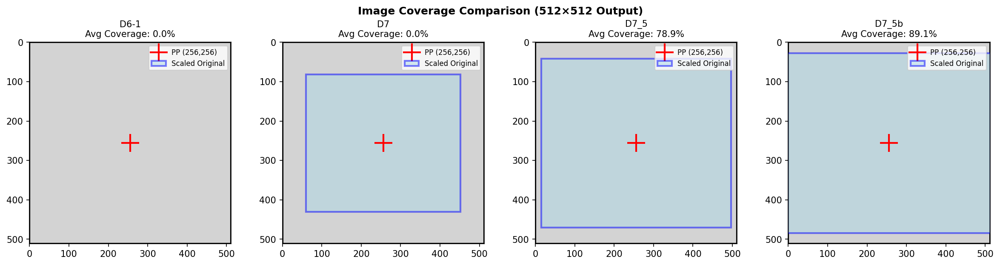

# Preprocessing Methods Comparison Report

**Generated**: 2026-01-19 10:38:16

## 1. Summary Table

| Dataset | Method | Samples | fx | PP | Coverage |
|---------|--------|---------|-----|-----|----------|
| **D6-1** | unknown | 3600 | 530-557 | varies | 0.0% |
| **D7** | D7_PP_centered_shift | 3597 | 549 | (256,256) | 0.0% |
| **D7_5** | D7_5_optimal_coverage | 3597 | 641-706 | (256,256) | 78.9% |
| **D7_5b** | D7_5b_object_aware | 3597 | 680-793 | (256,256) | 89.1% |

## 2. Per-View Metrics

### D6-1

- **Method**: `unknown`
- **Description**: N/A
- **Train/Val**: 3240/360

| View | fx | cx | cy | Scale | Coverage |
|------|-----|-----|-----|-------|----------|
| 0 | 555.4 | 204.6 | 188.6 | 0.0000 | 0.0% |
| 1 | 529.7 | 211.7 | 163.5 | 0.0000 | 0.0% |
| 2 | 554.7 | 208.0 | 184.0 | 0.0000 | 0.0% |
| 3 | 546.5 | 198.2 | 209.2 | 0.0000 | 0.0% |
| 4 | 550.7 | 218.3 | 175.7 | 0.0000 | 0.0% |
| 5 | 557.0 | 208.7 | 199.8 | 0.0000 | 0.0% |

### D7

- **Method**: `D7_PP_centered_shift`
- **Description**: PP-centered shift: cx=cy=256 with geometric consistency
- **Train/Val**: 3238/359

| View | fx | cx | cy | Scale | Coverage |
|------|-----|-----|-----|-------|----------|
| 0 | 549.0 | 256.0 | 256.0 | 0.3363 | 0.0% |
| 1 | 549.0 | 256.0 | 256.0 | 0.3527 | 0.0% |
| 2 | 549.0 | 256.0 | 256.0 | 0.3367 | 0.0% |
| 3 | 549.0 | 256.0 | 256.0 | 0.3418 | 0.0% |
| 4 | 549.0 | 256.0 | 256.0 | 0.3392 | 0.0% |
| 5 | 549.0 | 256.0 | 256.0 | 0.3354 | 0.0% |

### D7_5

- **Method**: `D7_5_optimal_coverage`
- **Description**: PP=256 with maximum image coverage (fx varies)
- **Train/Val**: 3238/359

| View | fx | cx | cy | Scale | Coverage |
|------|-----|-----|-----|-------|----------|
| 0 | 694.9 | 256.0 | 256.0 | 0.4257 | 81.6% |
| 1 | 640.7 | 256.0 | 256.0 | 0.4116 | 76.2% |
| 2 | 682.6 | 256.0 | 256.0 | 0.4187 | 78.9% |
| 3 | 705.8 | 256.0 | 256.0 | 0.4394 | 86.9% |
| 4 | 645.8 | 256.0 | 256.0 | 0.3990 | 71.7% |
| 5 | 683.3 | 256.0 | 256.0 | 0.4174 | 78.4% |

### D7_5b

- **Method**: `D7_5b_object_aware`
- **Description**: PP=256 with object-aware maximum scaling
- **Train/Val**: 3238/359

| View | fx | cx | cy | Scale | Coverage |
|------|-----|-----|-----|-------|----------|
| 0 | 717.6 | 256.0 | 256.0 | 0.4396 | 87.0% |
| 1 | 696.2 | 256.0 | 256.0 | 0.4472 | 90.0% |
| 2 | 709.3 | 256.0 | 256.0 | 0.4351 | 85.2% |
| 3 | 730.8 | 256.0 | 256.0 | 0.4550 | 93.2% |
| 4 | 679.7 | 256.0 | 256.0 | 0.4200 | 79.4% |
| 5 | 793.2 | 256.0 | 256.0 | 0.4846 | 100.0% |

## 3. Method Comparison Analysis

### Key Differences

| Aspect | D6-1 | D7 | D7_5 | D7_5b |
|--------|---|---|---|---|
| **fx Fixed** | No | Yes | No | No |
| **PP at (256,256)** | No | Yes | Yes | Yes |
| **Avg Coverage** | 0.0% | 0.0% | 78.9% | 89.1% |

### Trade-off Summary

| Method | Advantage | Disadvantage |
|--------|-----------|--------------|
| **D6-1** | Object centered in frame | PP varies per view, geometric inconsistency |
| **D7** | PP mathematically correct, matches pretrained model | Object may be off-center, lower coverage |
| **D7_5** | Full image preserved, no information loss | fx varies per view |
| **D7_5b** | Full image preserved, no information loss | fx varies per view |

## 4. Visual Comparison

### 6-View Comparison

### Coverage Diagram

## 5. Recommendations

| Use Case | Recommended Dataset | Reason |
|----------|---------------------|--------|
| **FaceLift pretrained compatibility** | D7 | fx=549, PP=(256,256) matches exactly |
| **Maximum image quality** | D7_5 | Full image preserved, no cropping |
| **Maximum object detail** | D7_5b | Object-aware zoom, highest resolution |
| **Legacy/Debugging** | D6-1 | Object-centered for visual inspection |
