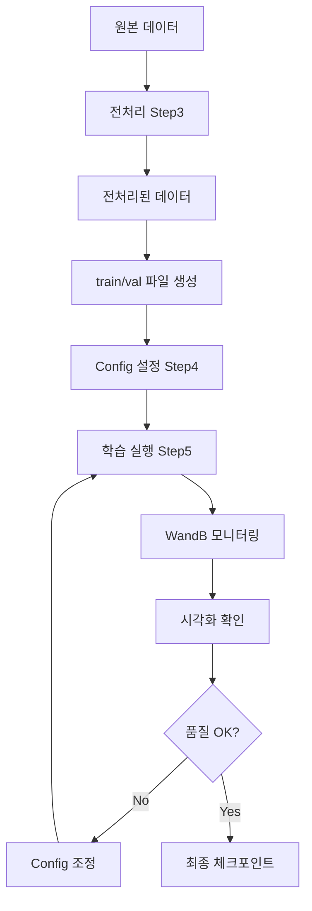

# Step 5: 학습 실행

> 설정이 완료된 후 실제 학습을 실행합니다.

## 5.1 학습 전 체크리스트

### 필수 확인 사항

- [ ] 전처리된 데이터 준비 (`data_mouse_train.txt`, `data_mouse_val.txt`)
- [ ] Pretrained checkpoint 다운로드 (`checkpoints/gslrm/ckpt_*.pt`)
- [ ] Config 파일 검증 (`configs/mouse/gslrm.yaml`)
- [ ] WandB 로그인 (`wandb login`)
- [ ] GPU 메모리 확인 (최소 24GB 권장)

### 데이터 구조 확인

```bash
# 데이터 파일 확인
head -3 data_mouse_train.txt
# 출력:
# /path/to/processed/sample_000
# /path/to/processed/sample_001
# /path/to/processed/sample_002

# 샘플 구조 확인
ls /path/to/processed/sample_000/
# 출력:
# images/
# opencv_cameras.json
```

---

## 5.2 Single GPU 학습

### 기본 실행

```bash
# Conda 환경 활성화
conda activate facelift

# 학습 실행
python train_gslrm.py --config configs/mouse/gslrm.yaml
```

### Overfit 테스트 (디버깅용)

```bash
# 소수 샘플로 overfitting 테스트
python train_gslrm.py --config configs/mouse/gslrm.yaml --overfit 5
```

**Overfitting 테스트 목적:**
- 코드가 정상 동작하는지 확인
- Loss가 빠르게 감소하는지 확인
- 시각화 출력이 정상인지 확인

---

## 5.3 Multi-GPU 학습 (DDP)

### torchrun 사용

```bash
# 4 GPU 학습
torchrun --nproc_per_node 4 --nnodes 1 \
    --rdzv_id ${RANDOM} --rdzv_backend c10d --rdzv_endpoint localhost:29500 \
    train_gslrm.py --config configs/mouse/gslrm.yaml
```

### 8 GPU 학습

```bash
torchrun --nproc_per_node 8 --nnodes 1 \
    --rdzv_id ${RANDOM} --rdzv_backend c10d --rdzv_endpoint localhost:29500 \
    train_gslrm.py --config configs/mouse/gslrm.yaml
```

---

## 5.4 학습 모니터링

### WandB Dashboard

```
https://wandb.ai/YOUR_USERNAME/facelift_mouse
```

**주요 메트릭:**
| 메트릭 | 설명 | 목표 |
|--------|------|------|
| `train/loss` | Total loss | ↓ 감소 |
| `train/l2_loss` | L2 reconstruction loss | ↓ 감소 |
| `train/psnr` | Peak SNR (dB) | ↑ 증가 (>25 좋음) |
| `train/perceptual_loss` | VGG perceptual loss | ↓ 감소 |

### 콘솔 출력 예시

```
[Step 100] Loss: 0.0523, LR: 0.000001, Time: 1.23s
[Step 200] Loss: 0.0412, LR: 0.000001, Time: 1.21s
...
```

---

## 5.5 시각화 확인

### 저장 위치

```
checkpoints/mouse_gslrm/
├── iter_00000100/
│   ├── input.jpg           # 입력 이미지
│   ├── supervision.jpg     # Ground truth
│   ├── turntable.jpg       # 3D 회전 시각화
│   └── aligned_gs_*.jpg    # Gaussian opacity/depth
├── iter_00000200/
│   └── ...
└── ckpt_*.pt               # 체크포인트
```

### 시각화 해석

| 파일 | 내용 | 확인 포인트 |
|------|------|-------------|
| `input.jpg` | 모델 입력 이미지 | - |
| `supervision.jpg` | GT 6 views | 정상 로드 확인 |
| `turntable.jpg` | 3D 재구성 결과 | 형태 정확성 |
| `aligned_gs_opacity_depth.jpg` | Gaussian 분포 | 생쥐 영역 집중 |

---

## 5.6 체크포인트 관리

### 자동 저장

```yaml
checkpointing:
  checkpoint_every: 100  # 100 step마다 저장
```

### 체크포인트 파일명

```
ckpt_0000000000000100.pt  # Step 100
ckpt_0000000000000200.pt  # Step 200
...
```

### 학습 재개

```bash
# 자동 재개 (checkpoint_dir에서 최신 ckpt 로드)
python train_gslrm.py --config configs/mouse/gslrm.yaml

# 특정 체크포인트에서 재개
python train_gslrm.py --config configs/mouse/gslrm.yaml \
    --load checkpoints/mouse_gslrm/ckpt_0000000000001000.pt
```

---

## 5.7 문제 해결

### CUDA Out of Memory

```yaml
# configs/mouse/gslrm.yaml 수정
training:
  dataloader:
    batch_size_per_gpu: 1  # 2 → 1로 감소
  runtime:
    grad_accum_steps: 4    # 2 → 4로 증가 (effective batch 유지)
```

### Loss가 감소하지 않음

1. **Learning rate 확인**: `lr: 1e-6` 이 너무 낮을 수 있음 → `1e-5` 시도
2. **Data 확인**: 전처리가 올바른지 검증 (Step 3.5)
3. **Checkpoint 확인**: Pretrained checkpoint 정상 로드 여부

### WandB 연결 오류

```bash
# 오프라인 모드로 전환
export WANDB_MODE=offline
python train_gslrm.py --config configs/mouse/gslrm.yaml
```

---

## 5.8 학습 완료 후

### 최종 체크포인트 저장

```
checkpoints/mouse_gslrm/ckpt_0000000000010000.pt
```

### 추론 테스트

```bash
# Config의 inference 섹션 활성화 후
python train_gslrm.py --config configs/mouse/gslrm.yaml --inference
```

### 결과 평가

```bash
# 시각화 결과 확인
ls checkpoints/mouse_gslrm/iter_*/
```

---

## 5.9 요약: 전체 실행 흐름



---

## 🎉 축하합니다!

FaceLift Mouse Adaptation 구현을 완료했습니다.

### 구현한 모듈 요약

1. ✅ `gslrm/data/mouse_dataset.py` - MouseViewDataset
2. ✅ `scripts/preprocess_mouse.py` - 전처리 스크립트
3. ✅ `configs/mouse/gslrm.yaml` - Mouse config
4. ✅ `train_gslrm.py` 수정 - `use_mouse_dataset` 플래그

### 다음 단계 (선택적)

- Multi-view Diffusion 학습 (MVDiffusion)
- 추론 파이프라인 구현
- Gradio 앱 수정

---

*Created: 2026-01-13*
