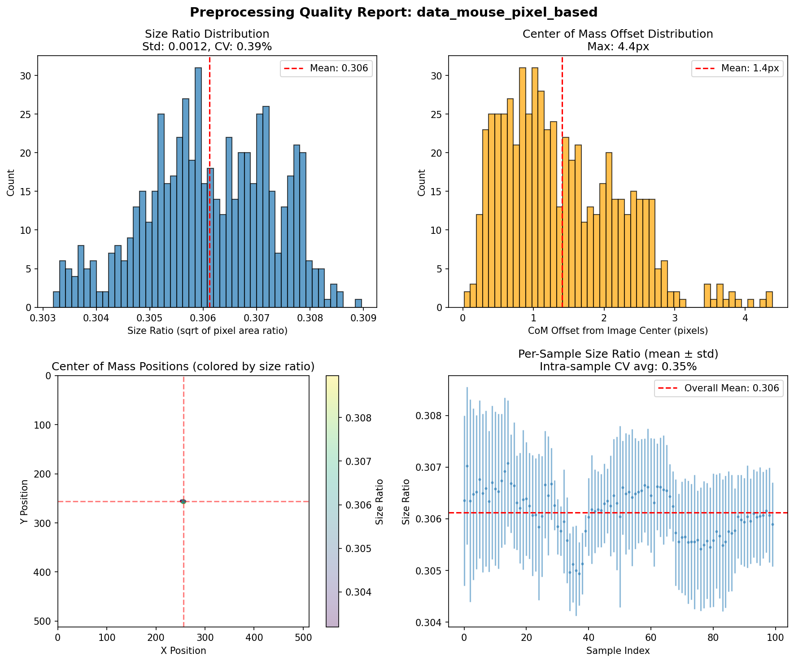
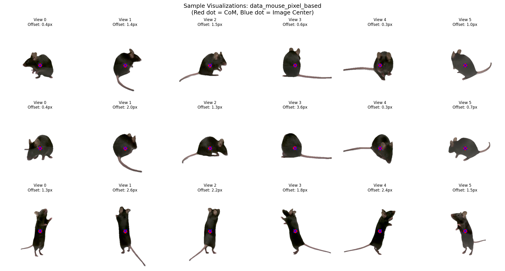

# Preprocessing Quality Report: data_mouse_pixel_based

## Overview

| Metric | Value |
|--------|-------|
| Dataset Path | `data_mouse_pixel_based` |
| Samples Analyzed | 100 |
| Total Views | 600 |
| Quality Grade | **A (Excellent)** |

## Size Ratio Statistics (Pixel-Based)

> Size ratio = sqrt(object_pixels / total_pixels)
> Target: Uniform across all views

| Metric | Value |
|--------|-------|
| Mean | 0.3061 (30.6%) |
| Std | 0.0012 |
| CV (Coefficient of Variation) | **0.39%** |
| Min | 0.3032 (30.3%) |
| Max | 0.3090 (30.9%) |
| Range | 0.0058 |

### Interpretation
- CV < 1%: Excellent uniformity
- CV 1-3%: Good uniformity
- CV 3-5%: Acceptable
- CV > 5%: Needs improvement

## Center of Mass (CoM) Statistics

> CoM offset = distance from image center to object center of mass
> Target: Near zero (object centered)

| Metric | Value |
|--------|-------|
| Mean Offset | **1.4px** (0.27% of image) |
| Std | 0.8px |
| Max Offset | 4.4px |
| 95th Percentile | 2.7px |
| 99th Percentile | 3.8px |

### Interpretation
- Mean < 5px: Excellent centering
- Mean 5-10px: Good centering
- Mean 10-20px: Acceptable
- Mean > 20px: Needs improvement

## Cross-View Consistency

| Metric | Value |
|--------|-------|
| Avg Intra-Sample Size CV | 0.35% |
| Avg Intra-Sample CoM Offset Std | 0.7px |

## Quality Distribution

### Size Ratio Histogram

### Sample Visualizations

## Recommendations

- Preprocessing quality is good. No immediate improvements needed.

## Generated
- Date: 2025-12-20 16:01:30
- Script: `scripts/evaluate_preprocessing.py`
